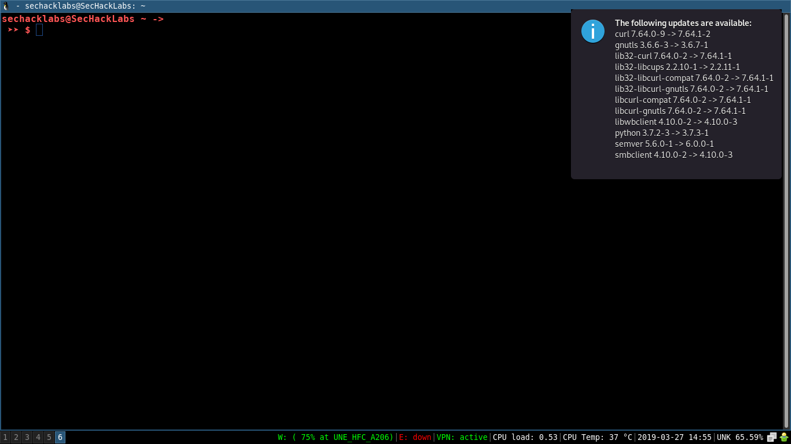
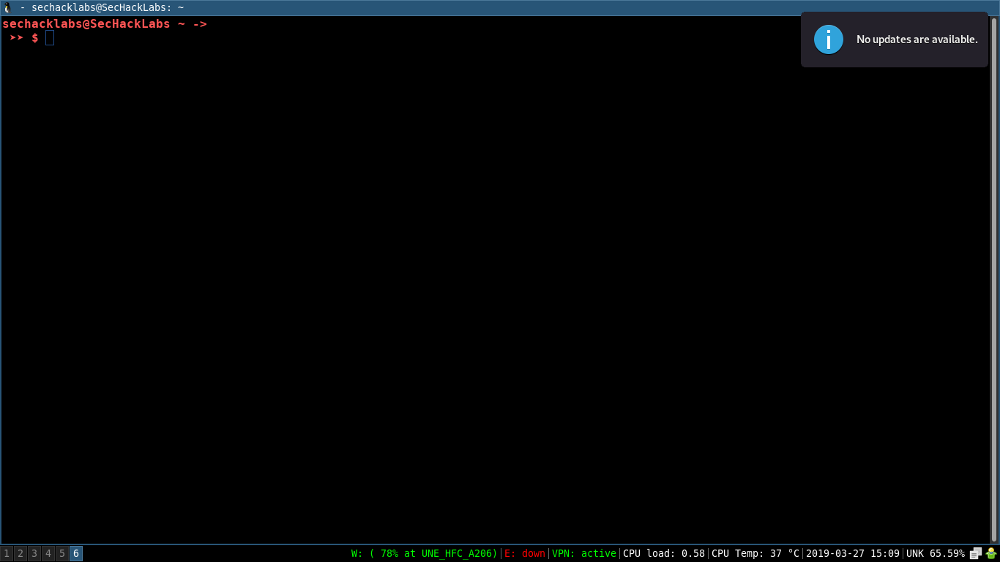

# upcheck

Checker and notifier for ArchLinux available updates writen in Rust that's totally Desktop/WM environment dependient.

# How to install and get it working?

**Using AUR package:**

Install the [upcheck](https://aur.archlinux.org/packages/upcheck/) package and enable/start the `upcheck.timer` user unit with `systemctl --user enable upcheck.timer && systemctl --user start upcheck.timer`

**Manually:**

First install [pacman-contrib](https://www.archlinux.org/packages/community/x86_64/pacman-contrib/) from ArchLinux repos:

```
# pacman -Syu --needed pacman-contrib
```

Installation is easy, put the `bin/upcheck` binary in the /usr/bin/ system directory, then put the `upcheck.service` and `upcheck.timer` into $HOME/.config/systemd/user/ and finally enable/start the `upcheck.timer` unit with the command `systemctl --user enable upcheck.timer && systemctl --user start upcheck.timer`

**Important note**: you need a [notifications server](https://wiki.archlinux.org/index.php/Desktop_notifications#Notification_servers) if you aren't using Cinnamon, Deepin, Enlightenment, GNOME, GNOME Flashback or KDE Plasma.

# Building yourself

If you don't want to use the provided binary, you can compile it following the next commands:
```
# pacman -S rust
$ git clone https://gitlab.com/edu4rdshl/upcheck.git
$ cd upcheck
$ cargo build --release
$ cp target/release/upcheck $HOME/.local/bin/
```
Then continue with "How to install and get it working" skipping the binary section.

# How it works?

It use the `checkupdates` bash script provided by the `pacman-contrib` package. First, it exec the command `checkupdates` and save the output in a variable, if the variable is not an empty string, mean that there are available updates and then send the variable content using the  [notify-rust](https://crates.io/crates/notify-rust) crate.

# What is the purpose?

It doesn't have any special purpose, it was created only trying to avoid the user manual interaction of checking available updates everytime and show it when are available.

# How can I change the execution frequency time?

Modify the `upcheck.timer` unit and change the OnUnitActiveSec= option to what you want. See `man 7 systemd.time` for the time specifications.

# Screenshots

Here's a couple of screenshots of upcheck in action:

Updates available:




No updates available:


